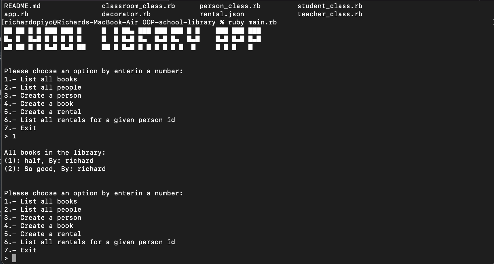

 #  School Library
Imagine that you are a librarian of a University, this app allows you to record what books are in the library and who borrows them.

 ## Screenshot

 
 ## Built With

 - Ruby

 ## Getting Started

 To get a local copy up and running follow these simple example steps.
- git clone  `https://github.com/Kakalanp/OOP-school-library.git`

- change to the directory using `cd OOP-school-library`

- open with your prefffered code editor.

 ## Running the project

To run the project,
- Navigate to the root directory of the project `cd OOP-school-library`
- run `ruby main.rb`
-Follow the prompts displayed on the screen

 ## Authors:

### 👤 Joaquin G.L. Zanetti
- GitHub: [@Kakalanp](https://github.com/Kakalanp)
- Twitter: [@LeccaJoaquin](https://twitter.com/LeccaJoaquin)
- LinkedIn: [Joaquín Garrido Lecca Zanetti](https://www.linkedin.com/in/joaquin-garrido-lecca-zanetti/)

### 👤 **Richard Opiyo**

- GitHub: [@richardoppiyo](https://github.com/richardoppiyo)
- Twitter: [@blessed_ricky](https://twitter.com/blessed_ricky)
- LinkedIn: [Richard Opiyo](https://linkedin.com/in/richardoppiyo) 

 ## 🤝 Contributing

 Contributions, issues, and feature requests are welcome!

 Feel free to check the [issues page](https://github.com/usorfaitheloho/school-library/issues).

 ## Show your support

 Give a ⭐️ if you like this project!

 ## Acknowledgments

 - Microverse: [microverse community](https://github.com/microverseinc)

 ## 📝 License

 This project is [MIT](./MIT.md) licensed.